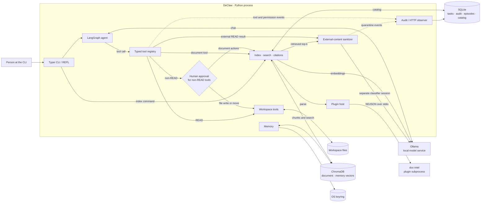

# DeClaw

**A local AI agent for working with private documents.** DeClaw runs an agent and document search on your machine, asks before changing files, and records its actions. The current working interface is a command-line application.

> **Development status:** The Python CLI, agent loop, filesystem tools, document indexing and search, plugin host, memory, and audit code are present on this branch. The FastAPI gateway, connected desktop experience, installer, and shell sandbox are still future work. See [Implementation status](#implementation-status).

[Quickstart](#quickstart) · [Architecture](#architecture) · [Data flows](#data-flows) · [Security boundaries](#security-boundaries) · [Repository map](#repository-map)

## What works today

- **Local conversation:** A LangGraph agent uses Ollama for model inference. English and French are supported by the core application.
- **Workspace tools:** Typed read, list, write, and move operations stay within the configured workspace. Write-class operations require a human decision.
- **Document questions:** The built-in `doc-intel` plugin parses PDF, DOCX, XLSX, text, and Markdown files. DeClaw indexes changed files, retrieves relevant passages, screens retrieved text, and supplies structural citations.
- **Local state and audit:** SQLite stores structured records; ChromaDB stores document and semantic vectors. An audit trail records tool calls, permission decisions, quarantine events, and instrumented HTTP requests.
- **Architecture explorer:** [`docs-site/`](./docs-site/) documents the system with interactive diagrams and source references. A separate [three-language Atlas](https://declaw-architecture-atlas.ngoanhhungbhmt2k4.chatgpt.site) is currently owner-private.

The implementation is **pre-release**. Availability of a code path or passing tests is not a claim that the product is ready for regulated production use.

## Quickstart

**Requirements:** Python 3.12+, [uv](https://docs.astral.sh/uv/), and a running [Ollama](https://ollama.com/) service. DeClaw uses these model defaults:

| Purpose | Default model |
| --- | --- |
| Agent | `qwen2.5:3b` |
| External-content classifier | `qwen2.5:7b` |
| Embeddings | `nomic-embed-text` |

```bash
uv sync --frozen

ollama pull qwen2.5:3b
ollama pull qwen2.5:7b
ollama pull nomic-embed-text

uv run declaw status
uv run declaw plugins list
uv run declaw index
uv run declaw chat
```

`declaw index` indexes the default workspace (`~/DeClaw-workspace`), or an optional path **inside** that workspace. Run it before asking about document contents. `declaw chat` starts an interactive session; type `/exit` to leave. The `doc-intel` plugin must be enabled for document parsing, search, and summarization. If it is disabled, run `uv run declaw plugins enable doc-intel`.

Configuration is loaded from environment variables and an optional local `.env` file; [`.env.example`](./.env.example) lists the settings. `DECLAW_WORKSPACE_DIR` selects the document folder, while `DECLAW_DATA_DIR` selects the application data folder. Keep `.env` out of Git.

Other implemented commands include `declaw report`, `declaw audit export`, `declaw memory export`, `declaw memory wipe`, and `declaw plugins list|enable|disable|revoke`. `declaw start` and `declaw stop` currently report that the gateway is unavailable.

## Architecture

DeClaw is principally **one local Python application** with internal modules. Ollama is a separate model service. Each loaded plugin runs in a separate local Python process. SQLite, ChromaDB, the workspace, and the OS keyring are data dependencies, not HTTP microservices.



The diagram shows the current module and process boundaries. The audit observer also instruments `httpx` requests in the core process, including Ollama calls. The gateway and desktop UI are omitted because they do not yet serve this path.

### Components

| Component | Responsibility | Start reading |
| --- | --- | --- |
| CLI and session | Configure the session, start the REPL, wire dependencies, and expose commands | [`declaw/main.py`](./declaw/main.py), [`declaw/brain/repl.py`](./declaw/brain/repl.py) |
| Agent | Alternate model reasoning and tool execution; treat tool refusals as observations | [`declaw/brain/loop.py`](./declaw/brain/loop.py) |
| Tool registry | Validate schemas and route reads, approvals, sanitization, and audit wrapping | [`declaw/tools/registry.py`](./declaw/tools/registry.py) |
| Document pipeline | Index changed files, search safe passages, and construct citations | [`declaw/documents/`](./declaw/documents/) |
| Plugin host | Check manifests and grants; supervise a process per loaded plugin | [`declaw/plugin_host/`](./declaw/plugin_host/), [`plugins/builtin/doc-intel/`](./plugins/builtin/doc-intel/) |
| Safety filter | Classify untrusted text in a separate model session and quarantine unsafe results | [`declaw/sanitizer/`](./declaw/sanitizer/) |
| Memory and storage | Manage episodes, encrypted text payloads, vectors, and the document catalog | [`declaw/memory/`](./declaw/memory/), [`declaw/db/`](./declaw/db/) |
| Audit | Persist structured events, render deterministic reports, and observe core HTTP traffic | [`declaw/audit/`](./declaw/audit/) |

## Data flows

**A file read:** the model requests a validated `filesystem_read` call → the path is checked against the workspace → returned text passes through the sanitizer → safe text becomes a tool observation. Unsafe text or a classifier failure produces a quarantine result. The audit wrapper records the outcome.

**A file change:** the model requests a typed write, move, organize, or summary action → a human sees the proposed action → denial stops execution; approval lets the validated tool run → the outcome is recorded. This is a separate route from the sanitizer for external READ results.

**Document indexing:** `declaw index` finds supported files → compares content hashes with the SQLite catalog → calls `doc-intel` through the plugin host → embeds parsed chunks through Ollama → stores encrypted chunk text and searchable vectors in ChromaDB → updates the catalog **after** storage succeeds. A scoped indexing run reconciles deleted or renamed files only within the scanned subtree. Scanned PDFs without readable text are reported; OCR is not implemented.

**Document search:** a question reaches `document_search` → the query is embedded and ChromaDB returns the most relevant chunks → a sanitizer screens the retrieved top-k chunks, caching verdicts per chunk hash → safe hits are returned with source metadata for citations. Indexing does not classify every chunk in advance.

## Security boundaries

These are properties of the **current code**, with their practical scope:

- File tools reject paths that escape the configured workspace. Non-READ tools use a confirmation provider; the default answer is denial.
- The model receives typed tool schemas. With the default security settings, external file reads and retrieved document passages are screened before they enter its context. The classifier uses a separate Ollama session and fails closed on classification errors.
- Document and semantic-memory **text payloads** are encrypted before ChromaDB storage. Embedding vectors and some searchable metadata are **not** encrypted. SQLite should not be described as wholly encrypted.
- Credentials use the OS keyring, with an encrypted file fallback when the keyring has no usable backend.
- The HTTP observer records requests made through `httpx` in the core process and flags hosts outside its local allowlist. It is **not** an operating-system firewall or a proof that all processes made zero network requests. Ollama's host is configurable.
- Plugin subprocesses and permission checks are implemented. A subprocess boundary does not provide the isolation of a full OS sandbox. Shell execution and its sandbox are deferred; no shell tool ships in the current CLI.

See [`docs/`](./docs/) for detailed reviews, security decisions, and limitations. Do not use this README alone as a compliance or privacy certification.

## Implementation status

| Area | State on this branch |
| --- | --- |
| CLI, LangGraph brain, typed filesystem tools | Implemented and wired into `declaw chat` |
| Sanitizer, confirmation gate, SQLite audit, HTTP observer | Implemented in the CLI path |
| Memory, credentials, plugin host and SDK | Implemented in source |
| `doc-intel` parsing, indexing, retrieval, citations, and document actions | Implemented in source and CLI paths; quality and performance still need product validation |
| Gateway / API | Configuration and package skeleton; `start` and `stop` are stubs |
| Desktop UI, Tauri integration, installer | Repository scaffolding; no working end-user desktop release |
| Shell execution and sandbox | Deferred; no shell tool is exposed |

The [ticket backlog](./TICKETS.md) and [phase reviews](./docs/README.md) provide finer-grained progress. The status above follows executable code rather than old phase labels.

## Repository map

```text
declaw/                 Python application
  brain/                Agent graph, model adapter, context management
  tools/                Typed tools, registry, confirmation, workspace paths
  documents/            Indexing, search, citations, document actions
  sanitizer/            External-text classification and quarantine
  plugin_host/          Manifests, grants, subprocess supervision, IPC
  memory/               Conversation, episodic and semantic memory
  audit/                Events, reports, HTTP observation
  credentials/          OS keyring and encrypted fallback
  db/                   SQLite models and engine
  gateway/, sandbox/    Future runtime surfaces
declaw_plugin_sdk/      Protocol used by plugin subprocesses
plugins/builtin/        Built-in doc-intel plugin
alembic/                Database migrations
docs-site/              Source-linked architecture documentation site
docs/                   Phase reviews, specifications, design decisions
ui/, tauri/             Future desktop interface scaffolding
tests/                  Unit, integration, security and regression tests
```

## Development

The repository uses `uv.lock` for Python dependencies. Run the same Python checks as CI:

```bash
uv sync --frozen
uv run ruff check .
uv run mypy declaw declaw_plugin_sdk
uv run pytest
```

The documentation site has its own Node project under [`docs-site/`](./docs-site/), with `npm ci`, `npm run guards`, and `npm run build`. Its guards check source references and module coverage against this repository. Development context and open decisions live in [`CLAUDE.md`](./CLAUDE.md).

## License

The project metadata declares **AGPL-3.0-or-later** in [`pyproject.toml`](./pyproject.toml).
